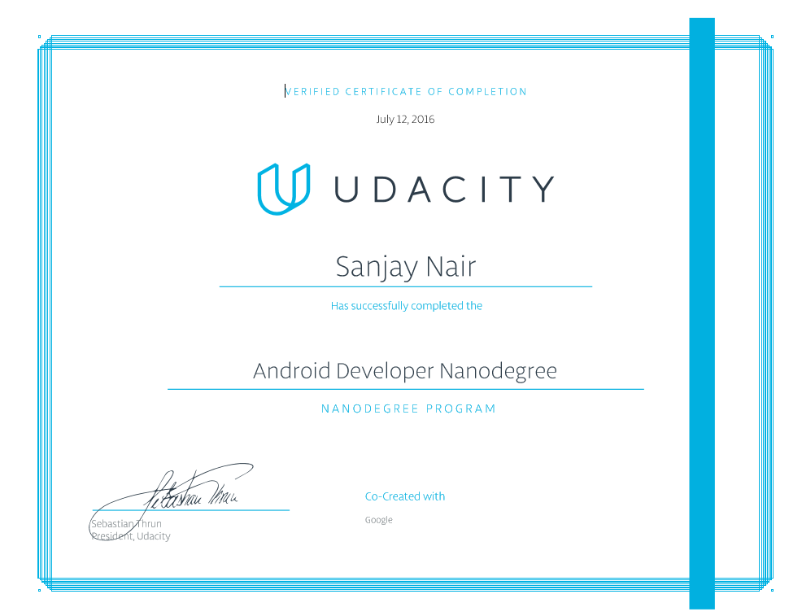

## Android Nano Degree from Udacity

For intermediate Java developers pursuing Android specialization, this program teaches the tools, principles, and patterns that underlie all Android development.

https://www.udacity.com/course/android-developer-nanodegree-by-google--nd801

